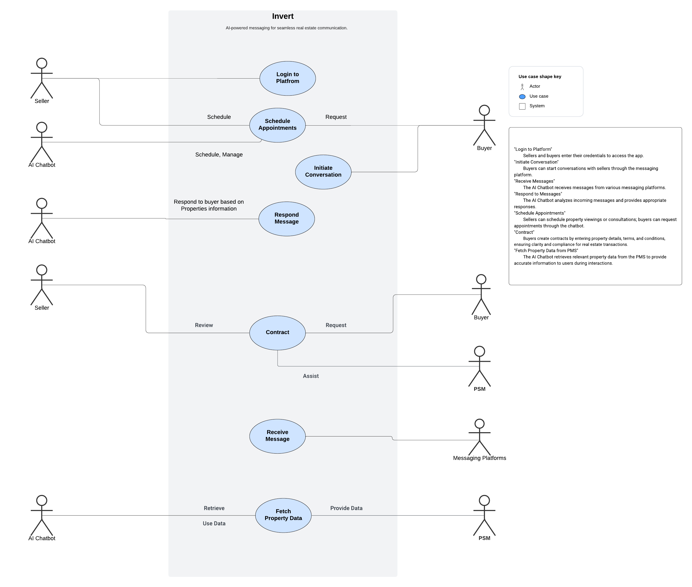
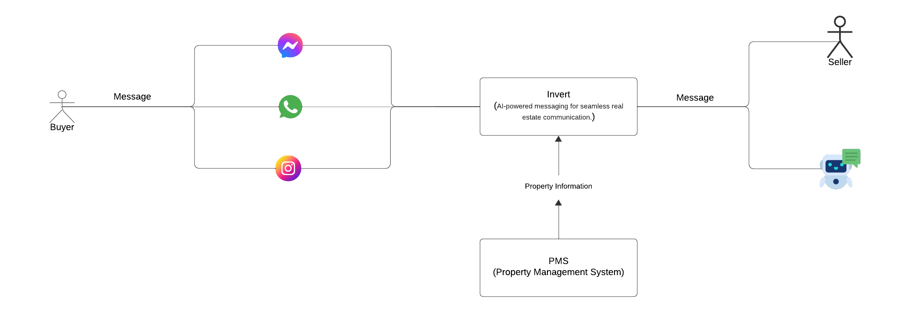
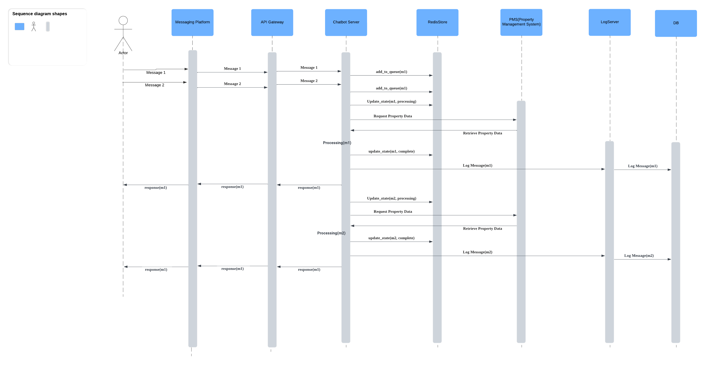
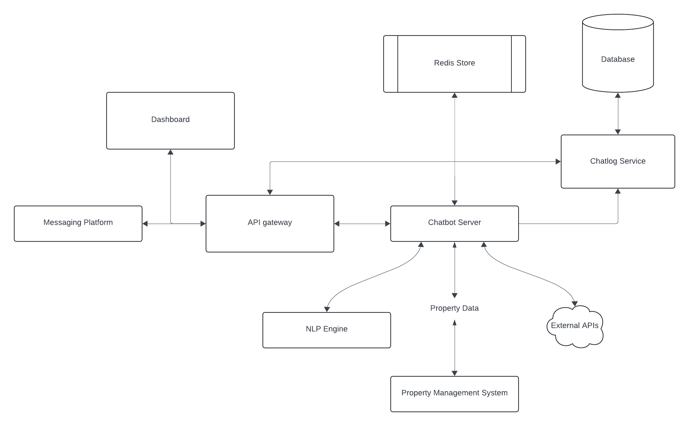
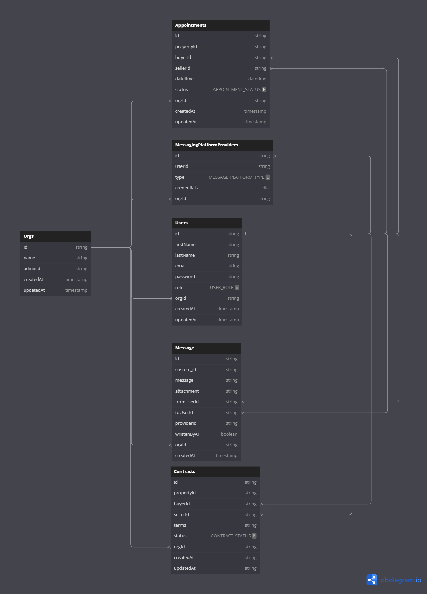

# AI-powered platform for hotels to automate guest engagement

## Overview

InvertAI is a conversational AI platform designed for the hospitality industry. It automates guest messaging across various platforms, including WhatsApp, Instagram, and Facebook, using technology like ChatGPT and other large language models (LLMs). This helps hotels increase direct bookings and streamline their communication processes.

## Use Case

## Workflow

## Sequence Case

## System Design

## Database Design

# Author

[Discord](https://discord.gg/TawJX4ue)
[Email](mailto:worker.opentext@gmail.com)
